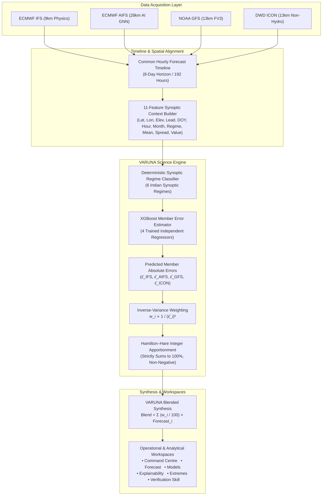

# VARUNA — Hybrid AI–NWP Weather Intelligence
### SIH26081 • Smart India Hackathon 2026

[](https://varuna-rose.vercel.app)
[](https://varuna-backend-grfc.onrender.com/api/health)
[](VARUNA_SIH_FINAL_DEMO_SCRIPT.pdf)
[](src/ml/scientific_audit.test.js)
[](varuna-backend/tests)
[-brightgreen?style=flat-square&logo=eslint)](package.json)
[](LICENSE)

> **Live Deployments:**  
> **Frontend:** [https://varuna-rose.vercel.app](https://varuna-rose.vercel.app)  
> **Backend API:** [https://varuna-backend-grfc.onrender.com](https://varuna-backend-grfc.onrender.com)  
> **API Health:** [https://varuna-backend-grfc.onrender.com/api/health](https://varuna-backend-grfc.onrender.com/api/health)  
>  
> **SIH 2026 Presentation Resources:**  
> • **Official Demo Script & Recording Choreography (PDF):** [`VARUNA_SIH_FINAL_DEMO_SCRIPT.pdf`](VARUNA_SIH_FINAL_DEMO_SCRIPT.pdf) *(Under-3-minute timestamped recording guide & narration)*  
> • **Interactive HTML Presentation Companion:** [`VARUNA_SIH_FINAL_DEMO_SCRIPT.html`](VARUNA_SIH_FINAL_DEMO_SCRIPT.html)  
> • **Multi-Variable Validation Report:** [`varuna-backend/reports/MULTIVARIABLE_VALIDATION_REPORT.md`](varuna-backend/reports/MULTIVARIABLE_VALIDATION_REPORT.md)  
> • **Empirical Validation Protocol:** [`varuna-backend/docs/VALIDATION_PROTOCOL.md`](varuna-backend/docs/VALIDATION_PROTOCOL.md)

---

## 1. Problem & Core Concept

Numerical Weather Prediction (NWP) centres and artificial intelligence meteorological models provide multiple independent forecasts for India. However, forecast accuracy varies significantly depending on the atmospheric regime, geographical terrain, synoptic season, and forecast horizon. A model that excels over the high Western Ghats during the South-West Monsoon may exhibit substantial systematic bias over the arid Thar Desert or during post-monsoon cyclonic situations.

Operational forecasters and disaster management authorities face a critical dilemma:

$$\text{\textbf{“Four independent forecasts can disagree. Which one should we trust?”}}$$

**VARUNA** solves this by evaluating four leading numerical and AI-driven weather prediction models in real time, assessing their ensemble disagreement and contextual regime, predicting each model's expected absolute error via trained gradient-boosted meta-models, and synthesizing an adaptive, error-variance-weighted blend.

```
       [ ECMWF IFS ]      [ ECMWF AIFS ]      [ NOAA GFS ]      [ DWD ICON ]
         (Physics)           (AI GNN)            (FV3)          (Non-Hydro)
              \                  |                 |                 /
               \                 |                 |                /
                ▼                ▼                 ▼               ▼
             =========================================================
                           VARUNA SCIENTIFIC PIPELINE
             • 11-Feature Meteorological Context Vector
             • XGBoost Regressor Error Prediction (ε̂_m)
             • Inverse-Variance Weighting: w_m ∝ 1 / (ε̂_m)²
             • Hamilton–Hare Largest Remainder Integer Apportionment
             =========================================================
                                         │
                                         ▼
                            [ VARUNA ADAPTIVE BLEND ]
                     One auditable, error-minimized forecast
```

---

## 2. System Architecture & Request Pipeline

VARUNA operates a resilient, cloud-native architecture engineered to function with **zero developer laptop dependency**. 

### A. End-to-End Scientific Architecture



### B. Production Transport Topology

In production, VARUNA uses a hybrid high-performance transport path:
1. **Client-Side Direct Batch Acquisition:** The user's browser issues a single multi-coordinate batch request to Open-Meteo (`forecast_days=8`) for all 12 operational Indian regions. This bypasses serverless egress limits and prevents upstream rate-limiting (HTTP 429).
2. **Server-Side Scientific Processing:** The browser transmits the normalized time-series arrays to the VARUNA Python FastAPI processing endpoint (`POST /api/forecast/process` on Render).
3. **Execution & Return:** The FastAPI engine loads the trained XGBoost bundle, performs vectorized inference across all horizon hours in ~100 ms, normalizes weights via Hamilton–Hare, and returns the blended synthesis to the React UI.

```
 Browser (Vercel Client)
    │
    ├─► [Direct Batch Fetch] ──► Open-Meteo Gateway (8-Day Horizon, 12 Stations)
    │                             │
    │◄── [Normalized JSON Arrays]─┘
    │
    └─► [POST /api/forecast/process] ──► VARUNA FastAPI Processing Service (Render)
                                          │  • XGBoost Vectorized Inference
                                          │  • Hamilton-Hare Apportionment
                                          │  • Synoptic Regime Extraction
                                          ▼
                                       Blended Synthesis & Weights (JSON)
```

---

## 3. Meteorological Model Catalog

VARUNA evaluates four independent numerical weather and machine learning models:

| Model ID | Provider | Model Family | Native Resolution | Open-Meteo Identifier | Primary Strength |
| :--- | :--- | :--- | :--- | :--- | :--- |
| **ECMWF IFS** | ECMWF (Europe) | Physics-based Hydrostatic NWP | ~9 km global | `ecmwf_ifs025` | Gold standard global atmospheric physics; synoptic stability |
| **ECMWF AIFS** | ECMWF (Europe) | Data-Driven Graph Neural Network | ~28 km global | `ecmwf_aifs025_single` | Rapid non-linear spatial correlation; low bias in moderate regimes |
| **NOAA GFS** | NOAA / NCEP (USA) | Finite-Volume Cubed-Sphere (FV3) | ~13 km global | `gfs_seamless` | Excellent tropical convection dynamics; wide global operational use |
| **DWD ICON** | Deutscher Wetterdienst (Germany) | Icosahedral Non-Hydrostatic | ~13 km global | `icon_seamless` | Superior boundary layer physics and complex topographic handling |

---

## 4. Adaptive Weighting Methodology

For validated variables (2m Temperature and Surface Pressure), VARUNA executes a rigorous 5-step scientific weighting pipeline:

### Step 1: 11-Feature Synoptic Context Vector
For each target region, lead time, and forecast hour, VARUNA constructs an 11-dimensional feature vector $x$:
1. `latitude`: Station geographic latitude
2. `longitude`: Station geographic longitude
3. `elevation_m`: Station elevation above sea level
4. `lead_time_hours`: Forecast horizon (+24h, +48h, +72h, +120h, +168h)
5. `day_of_year`: Seasonal solar insolation indicator ($1 \dots 366$)
6. `hour_of_day`: Diurnal cycle indicator ($0 \dots 23$)
7. `month`: Annual synoptic calendar month ($1 \dots 12$)
8. `regime_index`: Deterministic meteorological regime ($0 \dots 5$)
9. `ensemble_mean`: Arithmetic mean of available NWP members
10. `ensemble_spread`: Inter-model spread ($\max(y) - \min(y)$)
11. `model_own_forecast`: The specific model's own predicted value for that hour

### Step 2: Member Absolute Error Estimation
The feature vector is fed to four independent XGBoost regressors ($80\text{ trees}$, $\text{max\_depth}=4$, $\text{learning\_rate}=0.06$):
$$\hat{E}_m = \max\left(\text{XGB}_m(x),\, 10^{-6}\right) \quad \text{for } m \in \{\text{IFS}, \text{AIFS}, \text{GFS}, \text{ICON}\}$$

### Step 3: Inverse-Variance Weighting
Model trust is allocated inversely proportional to the square of its predicted error:
$$W_m = \frac{1}{\hat{E}_m^2}, \quad w_m^* = \frac{W_m}{\sum_{k} W_k} \times 100$$

### Step 4: Hamilton–Hare Integer Apportionment
To ensure transparent, human-readable integer weights that strictly sum to $100\%$ without rounding bias:
1. Assign floor weights: $w_m^{\text{floor}} = \lfloor w_m^* \rfloor$.
2. Calculate fractional remainders: $r_m = w_m^* - w_m^{\text{floor}}$.
3. Apportion remaining units $100 - \sum w_m^{\text{floor}}$ one-by-one to members with the largest remainders $r_m$.
$$\sum_{m=1}^4 w_m = 100\%, \quad w_m \ge 0, \quad w_m \in \mathbb{Z}^+$$

### Step 5: Weighted Blend Synthesis
$$\hat{y}_{\text{VARUNA}} = \sum_{m=1}^4 \left(\frac{w_m}{100}\right) y_m$$

*(Note: VARUNA does NOT use integer linear programming or CP-SAT optimizers; it uses this exact closed-form, deterministic error-variance apportionment pipeline).*

---

## 5. Scientific Validation Boundaries

To maintain strict scientific integrity, VARUNA distinguishes between validated capabilities and operational baselines:

| Atmospheric Variable | Operational Stream | Weighting Scheme | Validation Status | Empirical Benchmark Reference | Scientific Resolution Rationale |
| :--- | :--- | :--- | :--- | :--- | :--- |
| **2m Temperature** | Live Operational | **Adaptive XGBoost** | **Validated** | Held-Out ERA5 ($N=4,512$, $0.780^\circ\text{C}$ RMSE) | **+29.4% RMSE reduction** vs best NWP center (ECMWF AIFS $1.105^\circ\text{C}$); +18.7% vs equal blend ($0.960^\circ\text{C}$). Promoted to adaptive production weighting. |
| **Surface Pressure** | Live Operational | **Adaptive XGBoost** | **Validated** | Held-Out ERA5 ($N=4,512$, $0.674\text{ hPa}$ RMSE) | **+9.9% RMSE reduction** vs best NWP center (DWD ICON $0.748\text{ hPa}$); +19.5% vs equal blend ($0.838\text{ hPa}$); Pearson $r = 1.000$. Promoted to adaptive production weighting. |
| **Rainfall (Precipitation)** | Live Operational | **Equal Consensus (25% each)** | **Consensus Maintained** | Held-Out ERA5 ($N=4,512$, $0.282\text{ mm}$ RMSE) | **Empirical Gate Triggered:** While continuous XGBoost penalized false alarms on dry hours (57.5% zero-inflation), wet-event Probability of Detection (POD) plummeted from **89.2% (equal blend) to 75.2% (adaptive)**, missing 475 actual rain events. Operational equal consensus retained to prevent flood/hazard false negatives. |
| **10m Wind Speed** | Live Operational | **Equal Consensus (25% each)** | **Consensus Maintained** | Held-Out ERA5 ($N=4,512$, $2.137\text{ km/h}$ RMSE) | **Empirical Gate Triggered:** Adaptive blend ($2.224\text{ km/h}$) underperformed equal consensus ($2.137\text{ km/h}$) across all operational leads (+24h to +120h) and degraded significantly on high-wind cases ($\ge 15.9\text{ km/h}$, 3.09 vs 2.49 km/h). Equal consensus retained as the statistically superior operational blend. |

### Boundaries & Commitments:
- **Truthful Validation Gating:** Adaptive XGBoost weighting is strictly activated for validated variables (**Temperature** and **Surface Pressure**), which empirically beat all single NWPs and baseline consensus on held-out test data. **Rainfall** and **Wind Speed** meta-models were fully trained and evaluated, but failed held-out promotion gates and remain strictly on operational equal-weight consensus.
- **No False Promotion Claims:** We do NOT claim operational ML promotion where empirical gates failed. Wind speed and rainfall models are preserved for auditability and research, while the operational stream runs pure equal consensus.
- **No Claim to Replace IMD:** VARUNA is an automated multi-model decision support tool. It does not replace official India Meteorological Department (IMD) synoptic forecasts or statutory disaster management bulletins.

---

## 6. Canonical Regional Scope & Forecast Horizons

VARUNA operates across 12 canonical Indian synoptic regions covering diverse microclimates:

| Region Key | Region Name | State / Territory | Synoptic Regime Zone | Elevation | Validation Status |
| :--- | :--- | :--- | :--- | :--- | :---: |
| `delhi_ncr` | Delhi NCR | Delhi / Haryana | North-West Plains | 216 m | **Benchmarked** |
| `mumbai_coastal` | Mumbai Coastal | Maharashtra | Konkan Maritime Zone | 14 m | **Benchmarked** |
| `western_ghats` | Western Ghats (Mahabaleshwar) | Maharashtra / Karnataka | High Ghats Escarpment | 1,353 m | **Benchmarked** |
| `gujarat_industrial` | Jamnagar Petrochemical Belt | Gujarat | Kathiawar Coastal Strip | 20 m | Regional Stream |
| `odisha_coast` | Paradip Port / Bay Coast | Odisha | Mahanadi Deltaic Littoral | 4 m | **Benchmarked** |
| `bengaluru_deccan` | Bengaluru Deccan | Karnataka | South Interior Plateau | 920 m | **Benchmarked** |
| `punjab_agri` | Punjab Central Agro-Belt | Punjab | Indo-Gangetic Basin | 247 m | Regional Stream |
| `assam_valley` | Guwahati / Brahmaputra Valley | Assam | Sub-Himalayan Trough | 55 m | Regional Stream |
| `chennai_coastal` | Chennai Coromandel | Tamil Nadu | Coromandel Coastal Plain | 6 m | Regional Stream |
| `rajasthan_thar` | Jodhpur / Western Thar | Rajasthan | Thar Arid Zone | 231 m | **Benchmarked** |
| `kerala_coast` | Kochi Malabar Coast | Kerala | Malabar Maritime Zone | 4 m | Regional Stream |
| `central_highlands` | Bhopal / Central Highlands | Madhya Pradesh | Vindhya Basin Plateau | 527 m | Regional Stream |

### Operational Lead Times:
- **+24 hours** (Day 1)
- **+48 hours** (Day 2)
- **+72 hours** (Day 3)
- **+120 hours** (Day 5)
- **+168 hours / 7 days** (Operational Horizon Cap)

---

## 7. Frontend Workspaces & Navigation

The user interface follows a structured three-tier architecture:

### A. Operations
* **Command Centre (`/command-centre`):** Geospatial situational awareness powered by MapLibre GL. Features national marker bubbles, regional triage ranking, category filters (Severe, Rainfall, Heat, Wind), and an operational watchlist drawer.
* **Forecast (`/forecast`):** Single-station deep dive displaying the 7-day multi-model timeline, VARUNA blend trajectory, lead-time horizon selector (+24h to +168h), ensemble spread metric, and individual NWP member cards.
* **Models (`/models`):** 5-member comparison table juxtaposing active forecasts, assigned weights, and historical benchmark skill (RMSE, MAE, bias, Pearson correlation).

### B. Analysis
* **Verification Skill (`/skill`):** Empirical statistical evaluation against the ERA5 reference reanalysis dataset across lead times (24h to 120h), 4 meteorological seasons, and 6 synoptic regimes.
* **Extremes Surveillance & Regional Reliability (`/extremes`):** Automated surveillance monitoring blended forecasts against configured hazard thresholds. Features:
  * **Surveillance Event Log & Operational Audit Stream:** Real-time multi-model ingestion telemetry, threshold scan passes across all 12 zones, and advisory records with interactive quick launcher buttons (`⚡ Quick Region Surveillance Drill-Down`).
  * **Regional Surveillance & Forecast Reliability Drawer:** Interactive modal drill-down across $\text{REGION} \times \text{VARIABLE} \times \text{LEAD} \times \text{RELIABILITY}$, rendering a 169-point multi-NWP timeseries (0h to 168h), real-time ensemble spread badge, lead reference line, Risk Index (0–100), Bust Probability ($P(\text{error} > \tau)$), 4-member NWP telemetry table, and 5-lead horizon degradation trend.
  * **OASIS CAP v1.2 Research Advisory Modal:** Generates structured XML/JSON bulletins for disaster management interop.
* **Explainability (`/explainability`):** WHAT $\to$ WHY $\to$ DETAIL audit trail showing multi-model disagreement, dynamic decision evidence (predicted errors vs assigned weights), and global XGBoost feature gain shares. Features enhanced NWP Member Comparison bar chart with `minPointSize={6}` baseline indicators and explicit `<LabelList>` formatting (e.g. `0.0 mm` on dry days) ensuring unanimous consensus is visually distinct from missing data.

### C. System
* **System Health (`/system`):** Multi-provider upstream connectivity monitors, latency gauges, SQLite cache status, fallback resilience diagnostics, and system audit trail.

---

## 8. Live-Data Integrity & Failure Protocol

VARUNA enforces strict operational truthfulness standards:

$$\begin{aligned}
\textbf{Live Processing Succeeds} &\implies \text{Display authentic live forecast numbers \& dynamic weights} \\
\textbf{Live Processing Fails} &\implies \text{Display prominent Rose-500 \texttt{LIVE DATA UNAVAILABLE} banner} \\
&\quad\ \text{\textbf{Strictly ZERO synthetic forecast numbers (render em-dashes `—` and 0\%)}} \\
\textbf{Demo / Replay Explicitly Chosen} &\implies \text{Render isolated reference data (strictly user-gated)}
\end{aligned}$$

- **No Silent Fallbacks:** The UI never masks network downtime or API errors with synthetic temperatures or rainfall numbers.
- **Authoritative `data_mode`:** The backend computes `data_mode` (`LIVE`, `CACHED`, `REPLAY`) and surfaces it directly to the interface.
- **Reference Data Separation:** Historical benchmark metrics ($N=4,512$ held-out records) remain accessible as immutable documentation even when the live stream is interrupted.

---

## 9. Extreme Weather Surveillance

VARUNA monitors blended forecasts against configured operational hazard thresholds:

| Extreme Hazard | Configured Hazard Threshold | Unit | Evaluated Scope | Evaluation Method |
| :--- | :--- | :--- | :--- | :--- |
| **Heavy Rainfall** | $\ge 64.5$ | mm / 24h | Blended Rainfall | 24-hour rolling accumulation |
| **Very Heavy Rainfall** | $\ge 115.6$ | mm / 24h | Blended Rainfall | 24-hour rolling accumulation |
| **Heatwave Advisory** | $\ge 45.0$ | °C | Blended Temperature | Instantaneous lead-time value |
| **Squally Wind** | $\ge 55.0$ | km/h | Blended Wind Speed | Instantaneous 10m wind speed |
| **Gale Wind Alert** | $\ge 62.0$ | km/h | Blended Wind Speed | Instantaneous 10m wind speed |

> **Important Advisory Note:** An alert indicates that the *evaluated blended forecast crossed a configured hazard threshold*. A "no active alert" status means the blended forecast did not exceed threshold criteria; it does not guarantee the absence of localized microscale severe weather. Rainfall and wind alerts operate on unvalidated consensus.

---

## 10. Empirical Verification Protocol

All historical statistical validation is conducted against the **ERA5 reanalysis dataset** (ECMWF Copernicus) across aligned historical NWP–ERA5 evaluation rows (86,004 total evaluations across 4 variables: 21,042 temperature, 21,024 pressure, 22,464 wind speed, 21,474 rainfall) over 6 benchmark regions, 4 forecast windows, and 4 synoptic forecast horizons (+24h, +48h, +72h, +120h):

- **Temporal Partitioning:** Chronological split (no random shuffling; strict temporal leakage prevention):
  - **Training Partition (65%):** 55,902 rows (13,170 per variable; Jan 10 – Jul 10, 2026)
  - **Validation Partition (15%):** 14,268 rows (3,360 per variable; Jul 10 – Sep 1, 2026)
  - **Strict Held-Out Test Partition (20%):** 18,048 rows (4,512 per variable; Sep 1 – Sep 8, 2026)

### Multi-Variable Empirical Promotion Gate Summary ($N = 4,512$ held-out test records per variable):

| Atmospheric Variable | Best Single NWP (RMSE) | Equal Blend (RMSE) | Static Inv-RMSE (RMSE) | VARUNA Adaptive (RMSE) | Improvement vs Best NWP | Held-Out Gate Decision | Operational Weighting Status |
| :--- | :--- | :--- | :--- | :--- | :---: | :---: | :--- |
| **2m Temperature** | $1.105^\circ\text{C}$ (AIFS) | $0.960^\circ\text{C}$ | $0.787^\circ\text{C}$ | **$0.780^\circ\text{C}$** | **$+29.41\%$** | **PASS** | **Adaptive XGBoost** (`validated=true`) |
| **Surface Pressure** | $0.748\text{ hPa}$ (ICON) | $0.838\text{ hPa}$ | $0.716\text{ hPa}$ | **$0.674\text{ hPa}$** | **$+9.9\%$** | **PASS** | **Adaptive XGBoost** (`validated=true`) |
| **10m Wind Speed** | $2.427\text{ km/h}$ (AIFS) | **$2.137\text{ km/h}$** | $2.171\text{ km/h}$ | $2.224\text{ km/h}$ | $+8.4\%$ (vs AIFS)<br>*$-4.1\%$ vs Equal* | **FAIL** | **Equal Consensus** (`validated=false`) |
| **Rainfall** | $0.323\text{ mm}$ (GFS) | $0.282\text{ mm}$ | $0.297\text{ mm}$ | $0.268\text{ mm}$ | $+17.0\%$ (vs GFS)<br>*Wet POD: $75.2\%$ vs $89.2\%$* | **FAIL** | **Equal Consensus** (`validated=false`) |

### Detailed Validated Variables Breakdown (Post-Monsoon Held-Out Test, $N=4,512$):

#### 2m Temperature (°C):
- **ECMWF IFS:** RMSE $1.195^\circ\text{C}$ | MAE $0.924^\circ\text{C}$ | Bias $-0.561^\circ\text{C}$ | Pearson $r = 0.973$
- **ECMWF AIFS (Best Single):** RMSE $1.105^\circ\text{C}$ | MAE $0.866^\circ\text{C}$ | Bias $+0.510^\circ\text{C}$ | Pearson $r = 0.981$
- **DWD ICON:** RMSE $1.131^\circ\text{C}$ | MAE $0.876^\circ\text{C}$ | Bias $+0.056^\circ\text{C}$ | Pearson $r = 0.969$
- **NOAA GFS:** RMSE $2.320^\circ\text{C}$ | MAE $1.874^\circ\text{C}$ | Bias $+0.674^\circ\text{C}$ | Pearson $r = 0.930$
- **Equal-Weight Blend:** RMSE $0.960^\circ\text{C}$ | MAE $0.759^\circ\text{C}$ | Bias $+0.170^\circ\text{C}$ | Pearson $r = 0.978$
- **VARUNA ADAPTIVE BLEND:** **RMSE $0.780^\circ\text{C}$** | **MAE $0.612^\circ\text{C}$** | **Bias $+0.066^\circ\text{C}$** | **Pearson $r = 0.984$**
- *Empirical Margin:* **$+29.41\%$ RMSE reduction vs the best single NWP** ($1.105 \to 0.780^\circ\text{C}$); **$+18.75\%$ reduction** vs equal blend.

#### Surface Pressure (hPa):
- **ECMWF IFS:** RMSE $0.932\text{ hPa}$ | MAE $0.751\text{ hPa}$ | Bias $-0.692\text{ hPa}$ | Pearson $r = 1.000$
- **ECMWF AIFS:** RMSE $0.809\text{ hPa}$ | MAE $0.637\text{ hPa}$ | Bias $-0.257\text{ hPa}$ | Pearson $r = 1.000$
- **DWD ICON (Best Single):** RMSE $0.748\text{ hPa}$ | MAE $0.602\text{ hPa}$ | Bias $-0.483\text{ hPa}$ | Pearson $r = 1.000$
- **NOAA GFS:** RMSE $1.763\text{ hPa}$ | MAE $1.459\text{ hPa}$ | Bias $-1.399\text{ hPa}$ | Pearson $r = 1.000$
- **Equal-Weight Blend:** RMSE $0.838\text{ hPa}$ | MAE $0.727\text{ hPa}$ | Bias $-0.708\text{ hPa}$ | Pearson $r = 1.000$
- **VARUNA ADAPTIVE BLEND:** **RMSE $0.674\text{ hPa}$** | **MAE $0.540\text{ hPa}$** | **Bias $-0.450\text{ hPa}$** | **Pearson $r = 1.000$**
- *Empirical Margin:* **$+9.9\%$ RMSE reduction** vs best single NWP ($0.748 \to 0.674\text{ hPa}$); **$+19.5\%$ reduction** vs equal blend.

### Scientific Rationale for Unvalidated Baseline Consensuses:
1. **Rainfall Zero-Inflation Degradation:** With 57.5% zero-inflation, continuous XGBoost minimizes global squared error by predicting near-zero values during light rain. Contingency analysis shows that while global RMSE improves slightly, Probability of Detection (POD) for wet events drops catastrophically from **89.2% (equal blend)** to **75.2% (adaptive XGBoost)**, missing 475 actual rain events (vs 206 for equal blend). At +24h lead, adaptive RMSE ($0.257\text{ mm}$) underperforms equal blend ($0.237\text{ mm}$). Gating protocol triggered an immediate **FAIL**, retaining operational equal-weight consensus.
2. **Wind Speed Sub-Optimal Weighting:** While the wind speed adaptive model outperforms single NWP centers, it underperforms simple equal-weight consensus across all lead times (+24h: 2.05 vs 1.98 km/h; +48h: 2.11 vs 1.99 km/h; +72h: 2.28 vs 2.20 km/h; +120h: 2.43 vs 2.36 km/h) and exhibits high-wind degradation ($\ge 25\text{ km/h}$, RMSE 3.09 vs 2.49 km/h). Gating protocol triggered **FAIL**, maintaining operational equal-weight consensus ($2.137\text{ km/h}$ RMSE).

---

## 11. Authoritative Backend API Endpoints

The FastAPI backend (`varuna-backend`) exposes the following endpoints:

| Method | Endpoint | Description |
| :--- | :--- | :--- |
| `GET` | `/api/health` | Health check returning service status, version, and model bundle verification. |
| `GET` | `/api/regions` | Catalog of 12 canonical regions with coordinates, elevations, and benchmark flags. |
| `GET` | `/api/forecast` | Query forecast for a single region, variable, and lead time with computed `data_mode`. |
| `POST` | `/api/forecast/process` | **High-performance processing endpoint:** accepts client-acquired NWP arrays and returns blended synthesis. |
| `GET` | `/api/weights` | Returns active Hamilton–Hare normalized weights and weighting scheme. |
| `POST` | `/api/analyze` | Evaluates multi-region batch matrices across synoptic lead times. |
| `GET` | `/api/analyze` | Query cached multi-region synoptic analysis. |
| `GET` | `/api/skill` | Verification skill tables (headline, by lead, by season, by region) vs ERA5. |
| `GET` | `/api/extremes` | IMD threshold evaluation and active alerts across all 12 operational regions. |
| `GET` | `/api/explain` | Decision evidence, predicted member errors ($\hat{\varepsilon}_m$), and global feature importances. |
| `GET` | `/api/providers/status` | Upstream latency and connectivity status across Open-Meteo gateways. |

---

## 12. Local Development Setup

### Prerequisites
- Node.js 18+ and npm
- Python 3.11+
- Git

### Backend Setup (FastAPI)
```powershell
cd varuna-backend
python -m venv venv
venv\Scripts\activate
pip install -r requirements.txt
python -m uvicorn app.main:app --port 8000 --reload
```
*API will run on [http://localhost:8000](http://localhost:8000). Interactive docs at [http://localhost:8000/docs](http://localhost:8000/docs).*

### Frontend Setup (React + Vite)
```powershell
# In the root repository directory
npm install
npm run dev
```
*Frontend will run on [http://localhost:5173](http://localhost:5173).*

---

## 13. Test Suites & Verification

### Frontend Scientific Audit Suite
Runs 10 automated tests validating statistical verification engine formulas, boundary & zero-length handling, Hamilton–Hare normalization, non-negativity across 192 parameter combinations, largest remainder edge cases, provider contracts, physical boundary clamping, system feed truthfulness, live regional matrix integrity, and missing lead/fallback resilience:
```powershell
npm test
```

### Frontend Linter
Validates React syntax, Hook dependency rules, and coding conventions via ESLint 9:
```powershell
npm run lint
```

### Production Build Verification
Compiles client bundles with Vite and validates syntax, worker loading, and styling assets:
```powershell
npm run build
```

### Backend Unit & Integration Tests
Runs 184 network-free tests with monkeypatched provider fixtures (including 19 dedicated multi-variable validation tests):
```powershell
cd varuna-backend
python -m pytest tests -q -p no:asyncio
cd ..
```

### End-to-End Production Acceptance Suite
Validates the deployed system ([https://varuna-rose.vercel.app](https://varuna-rose.vercel.app)) with laptop local servers completely OFF:
```powershell
node verify_production_e2e.mjs
```

---

## 14. Repository Structure

```
prakhar9642/VARUNA/
├── src/                               # React 19 Frontend
│   ├── components/
│   │   ├── layout/                    # TopBar, NavDrawer, Footer, AppLayout
│   │   ├── map/                       # MapLibre GL MapCore, ForecastLayer, MapControls
│   │   ├── modals/                    # RegionalSurveillanceDrawer, CAPBulletinModal
│   │   └── shared/                    # ChartCard, ForecastDetailDrawer, Badges
│   ├── data/                          # Canonical metadata, scientific reports, reference data
│   ├── ml/                            # Verification math and scientific audit test suite
│   ├── pages/                         # CommandCentre, Forecast, Models, Skill, Extremes, Explainability, SystemHealth
│   ├── services/                      # Authoritative API client (api.js), Open-Meteo batch connector
│   └── store/                         # Zustand state store (useStore.js)
├── varuna-backend/                    # Python FastAPI Scientific Engine
│   ├── app/
│   │   ├── api/                       # Modular FastAPI route controllers
│   │   ├── providers/                 # Open-Meteo httpx connector, SQLite cache
│   │   ├── science/                   # Alignment, deterministic regime classifier, weighting, verification
│   │   ├── services/                  # BlendService, resilience chain, client array processor
│   │   ├── config.py                  # Canonical constants (12 regions, thresholds, models)
│   │   └── main.py                    # App entry point, CORS middleware, lifespan
│   ├── data/                          # Aligned historical data, replay archives, provenance
│   ├── docs/                          # ARCHITECTURE, DATA_PROVENANCE, LIMITATIONS, VALIDATION_PROTOCOL
│   ├── models/                        # Serialized XGBoost meta-model bundles (joblib) across all 4 variables
│   ├── reports/                       # Multi-variable verification CSV reports, summary, and markdown reports
│   └── tests/                         # 184 network-free pytest tests
├── docs/                              # Architectural documentation and UI audit reports
├── VARUNA_SIH_FINAL_DEMO_SCRIPT.pdf   # Publication-ready executive demo & presentation guide
├── VARUNA_SIH_FINAL_DEMO_SCRIPT.html  # Interactive presentation script companion
├── verify_production_e2e.mjs          # Authoritative production E2E acceptance script
├── vercel.json                        # Vercel deployment routing configuration
├── package.json                       # Frontend dependencies and test scripts
└── README.md                          # Authoritative project presentation documentation
```

---

## 15. Structural Limitations

As detailed in [`varuna-backend/docs/LIMITATIONS.md`](varuna-backend/docs/LIMITATIONS.md), the following are structural constraints of the current system:
1. **Single-Season Held-Out Partition:** The chronological held-out test partition ($N=4,512$) covers Post-Monsoon (Sep 1–8, 2026). It must not be cited as verified performance across all seasons.
2. **Multi-Variable Promotion Gating:** Adaptive weighting is validated and operational for 2m temperature and surface pressure. Rainfall and wind speed models were trained and benchmarked, but truthfully retained on operational equal-weight consensus because they failed held-out promotion criteria (rainfall suppressed wet events; wind speed underperformed equal-weight consensus).
3. **Reanalysis vs In-Situ Ground Truth:** Verification uses ERA5 grid reanalysis as the truth proxy. It does not reflect direct AWS station observation data.
4. **Effective Sample Size:** While the test set contains 4,512 paired records, spatial and temporal auto-correlation reduces effective synoptic independence to ~188 distinct weather situations.
5. **GFS Outlier Influence:** NOAA GFS exhibits persistent positive temperature bias (+0.985 °C) across Indian regions. While Hamilton–Hare correctly downweights it (median ~10%), it widens inter-model spread metrics.
6. **Deterministic Regime Classifier:** Weather regimes are assigned via 6 deterministic meteorological rules rather than a learned clustering algorithm.
7. **Threshold Crossings vs Impacts:** Extremes detection indicates mathematical threshold crossings of the blended forecast, not localized damage or disaster impact predictions.

---

## 16. Contributors & Acknowledgements

- **Team VARUNA** — Smart India Hackathon 2026 (Problem Statement: SIH26081)
- **Data Providers:** ECMWF, NOAA/NCEP, DWD via [Open-Meteo](https://open-meteo.com/) (Licensed under CC BY 4.0).
- **Reference Dataset:** ECMWF ERA5 Reanalysis via Copernicus Climate Change Service (C3S).
